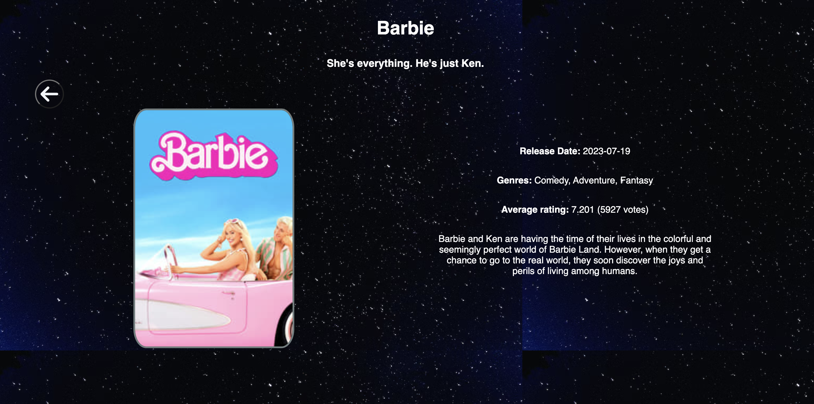

# Movie City

### Overview 
Welcome to Movie City, a React and TypeScript-powered Single Page App that utilizes The Movie Database API V3 to bring you information about movies, including titles, release dates, posters, and descriptions. The project is deployed with Netlify.

From the main view, you can see a carousel featuring trending movies. You can also perform a search by filtering by genre, popularity, title, and rating or directly writing on the input cage. 

*Snapshot: Main view showcasing trending movies.*

The list of movies is displayed with a badge indicating the vote average. This badge is shown in red if the value is less than 6; if it's greater than this number, it is displayed in blue.

*Snapshot: Main view of the Movie City application*

At both the top and bottom of the page, there is a pagination element that allows access to different pages, either previous or next.

*Snapshot: Main view showcasing pagination elements for easy navigation.*

When selecting a movie, you can view the details to obtain more information.

*Snapshot: Detailed view of a selected movie.*

### User stories

User Story 1: Movie Listing
As a user, I want to visualize the catalog of movies in a table (rows and columns).

Acceptance Criteria

The /discover/movie endpoint must be used.
The application includes pagination to explore the catalog by pages.
For each movie, at a minimum, display the poster, original title, and release year.

[User Story 2] Filtering and Sorting
As a user, I want to filter and sort the movie catalog using the criteria supported by The Movie Database API V3.

Acceptance Criteria

To filter, the /discover/movie endpoint must be used, along with one of its parameters, such as with_genres.
To sort, the /discover/movie endpoint must be used, along with one of its parameters, such as sort_by.
Pagination should retain the applied filter and sorting.
For each movie, at a minimum, display the poster, original title, and release year.

[User Story 3] Movie Details
As a user, I want to view the details of a movie.

Acceptance Criteria

The /movie/{movie_id} endpoint must be used.
For the movie, at a minimum, display the poster, original title, release year, genres, average rating, and total votes.
The interface should allow returning to the list of movies while preserving the applied filter and sorting.

### Technologies Used

- React
- TypeScript
- The Movie Database API V3
- Netlify (for deployment)
- Postman

### Acknowledgments

This project was crafted by Dulce Ramirez during the web development bootcamp at Laboratoria. Thank you for visiting! 😀👩🏻‍💻.